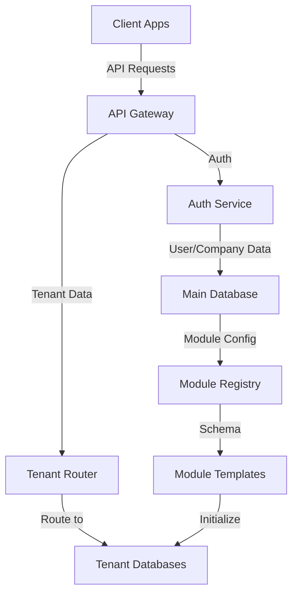
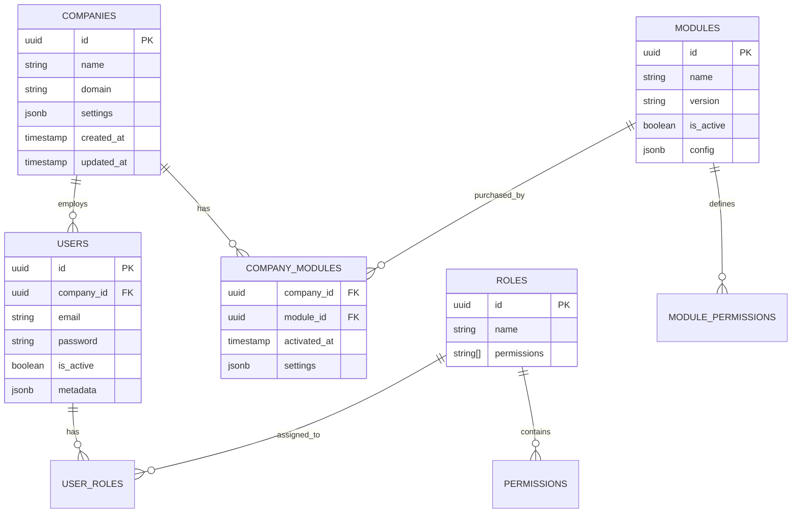
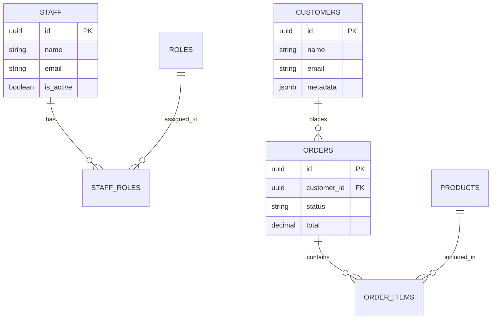
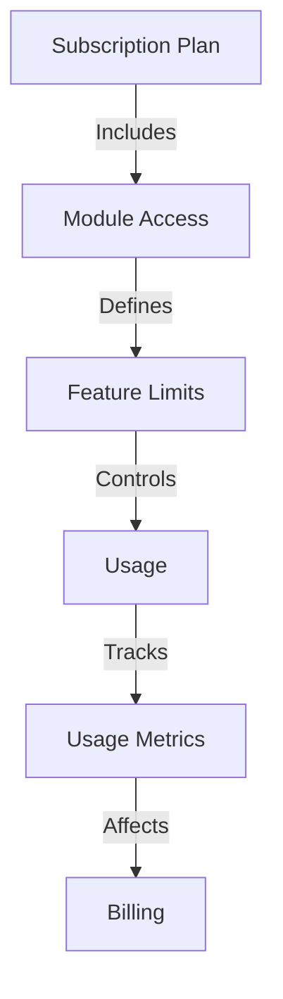
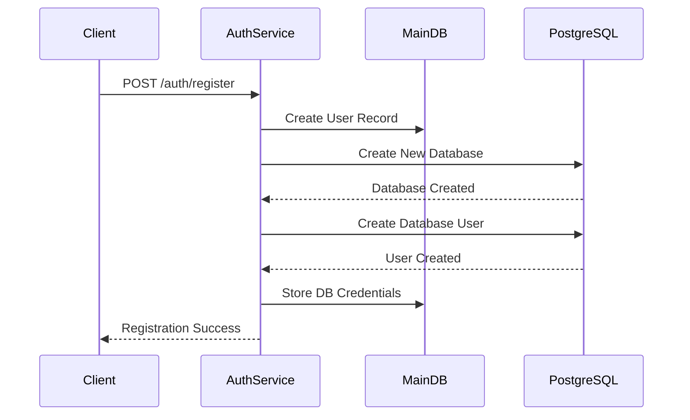
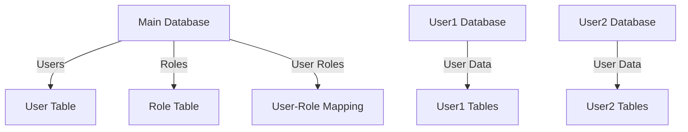
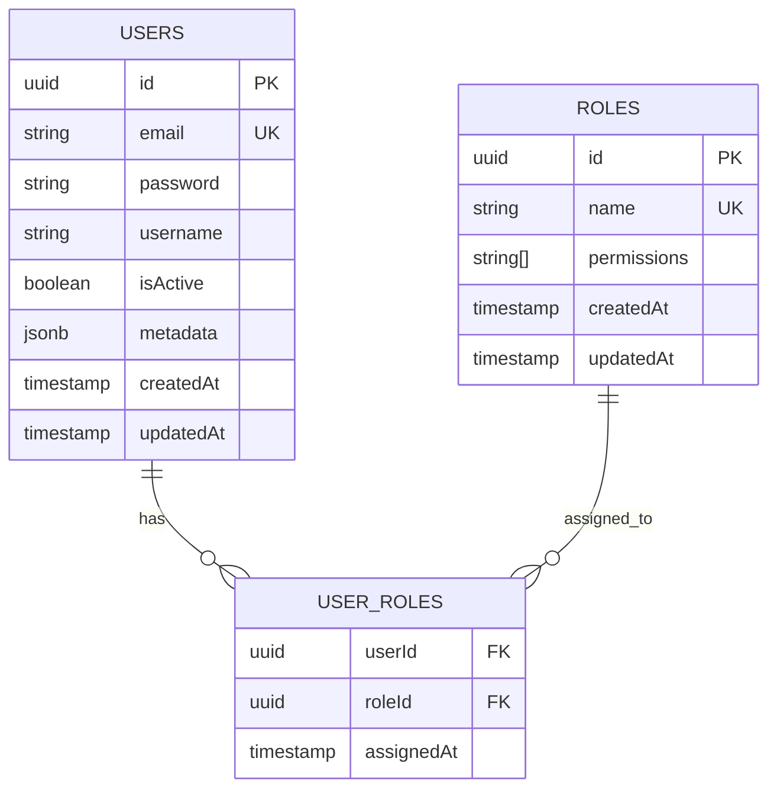

# Multi-Tenant SaaS Platform with Module System

## 🏗️ System Architecture



## 📦 Core Modules

### 1. Authentication & Authorization
- Multi-tenant user management
- Role-based access control
- JWT with tenant context
- SSO integration
- 2FA support

### 2. Company Management
- Company profiles
- Billing information
- Subscription management
- Usage metrics
- Custom domains

### 3. Module System
- Dynamic module loading
- Module dependencies
- Version control
- Update management
- Feature flags

## 🗄️ Database Architecture

### Main Database (auth_service)



### Tenant Database (per company)



## 🎯 Module System

### Available Modules

1. **CRM Module**
   - Customer management
   - Lead tracking
   - Sales pipeline
   - Contact management
   - Activity logging

2. **HRM Module**
   - Employee management
   - Attendance tracking
   - Leave management
   - Performance reviews
   - Payroll integration

3. **Inventory Module**
   - Stock management
   - Product catalog
   - Supplier management
   - Purchase orders
   - Barcode integration

4. **Accounting Module**
   - Invoicing
   - Expense tracking
   - Financial reports
   - Tax management
   - Bank reconciliation

5. **Project Management**
   - Task tracking
   - Team collaboration
   - Time tracking
   - Resource allocation
   - Project analytics

## 🔄 Module Integration

```typescript
interface Module {
  id: string;
  name: string;
  version: string;
  dependencies: string[];
  permissions: string[];
  routes: Route[];
  models: Model[];
  migrations: Migration[];
  seeders: Seeder[];
  hooks: {
    onInstall: () => Promise<void>;
    onUninstall: () => Promise<void>;
    onUpdate: () => Promise<void>;
  };
}
```

## 💰 Billing & Subscription



## 🔐 Security Features

1. **Data Isolation**
   - Database-level isolation
   - Row-level security
   - Tenant context validation

2. **Access Control**
   - Role-based permissions
   - Module-level access
   - Feature-level restrictions

3. **Audit Trail**
   - Action logging
   - Change tracking
   - Security events

## 🚀 API Structure

```typescript
// Example API Routes
/api/v1/auth/register
/api/v1/auth/login
/api/v1/companies
/api/v1/modules
/api/v1/tenants/{tenantId}/crm/customers
/api/v1/tenants/{tenantId}/hrm/employees
/api/v1/tenants/{tenantId}/inventory/products
```

## 📊 Monitoring & Analytics

1. **Usage Metrics**
   - Module usage
   - API calls
   - Storage usage
   - User activity

2. **Performance Monitoring**
   - Response times
   - Error rates
   - Resource usage
   - Database performance

3. **Business Analytics**
   - User growth
   - Module adoption
   - Revenue metrics
   - Customer insights

## 🔧 Development Tools

1. **Module Development Kit**
   - Module template
   - Testing framework
   - Documentation generator
   - Version management

2. **Tenant Management**
   - Database creation
   - Schema migration
   - Data seeding
   - Backup/restore

3. **Deployment Tools**
   - CI/CD pipelines
   - Environment management
   - Scaling configuration
   - Monitoring setup

## 📈 Scaling Strategy

1. **Horizontal Scaling**
   - Multiple API servers
   - Database sharding
   - Load balancing
   - Cache distribution

2. **Vertical Scaling**
   - Resource optimization
   - Query optimization
   - Connection pooling
   - Memory management

## 🔄 Integration Points

1. **Payment Gateways**
   - Stripe
   - PayPal
   - Razorpay
   - Custom integrations

2. **External Services**
   - Email services
   - SMS gateways
   - File storage
   - Analytics tools

3. **Third-party APIs**
   - Social login
   - Maps integration
   - Payment processors
   - Communication tools

## 🎨 Customization Options

1. **Theme System**
   - Brand colors
   - Custom logos
   - Layout options
   - Component styling

2. **Workflow Customization**
   - Custom fields
   - Business rules
   - Approval flows
   - Notification settings

3. **Integration Customization**
   - API endpoints
   - Webhook configuration
   - Data mapping
   - Sync settings

## User Registration Flow



## Database Structure



## Main Database Structure

The main database (`auth_service`) contains the following tables and data:



### 1. Users Table
- **id**: Unique identifier (UUID)
- **email**: User's email address (unique)
- **password**: Hashed password
- **username**: User's username
- **isActive**: Account status
- **metadata**: JSON field containing:
  - Database credentials
  - User preferences
  - Additional user data
- **createdAt**: Account creation timestamp
- **updatedAt**: Last update timestamp

### 2. Roles Table
- **id**: Unique identifier (UUID)
- **name**: Role name (e.g., "admin", "user", "manager")
- **permissions**: Array of permission strings
  - Example: ["users:read", "users:write", "roles:assign"]
- **createdAt**: Role creation timestamp
- **updatedAt**: Last update timestamp

### 3. User_Roles Table (Junction Table)
- **userId**: Foreign key to Users table
- **roleId**: Foreign key to Roles table
- **assignedAt**: Role assignment timestamp

### Example Data

```sql
-- Users Table Example
INSERT INTO users (id, email, username, password, is_active, metadata) 
VALUES (
    '550e8400-e29b-41d4-a716-446655440000',
    'user@example.com',
    'testuser',
    '$2b$10$encrypted_password_hash',
    true,
    '{
        "databaseName": "user_550e8400_e29b_41d4_a716_446655440000",
        "databaseUser": "user_550e8400_e29b_41d4_a716_446655440000",
        "databasePassword": "random_password",
        "preferences": {
            "theme": "dark",
            "language": "en"
        }
    }'
);

-- Roles Table Example
INSERT INTO roles (id, name, permissions) 
VALUES (
    '7c9e6679-7425-40de-944b-e07fc1f90ae7',
    'admin',
    ARRAY['users:read', 'users:write', 'roles:create', 'roles:assign']
);

-- User_Roles Table Example
INSERT INTO user_roles (user_id, role_id, assigned_at) 
VALUES (
    '550e8400-e29b-41d4-a716-446655440000',
    '7c9e6679-7425-40de-944b-e07fc1f90ae7',
    CURRENT_TIMESTAMP
);
```

### Database Relationships

1. **One-to-Many**: User to User_Roles
   - One user can have multiple role assignments
   - Each role assignment is unique to a user

2. **One-to-Many**: Role to User_Roles
   - One role can be assigned to multiple users
   - Each role assignment is unique to a role

3. **Many-to-Many**: Users to Roles
   - Users can have multiple roles
   - Roles can be assigned to multiple users
   - Junction table (User_Roles) manages these relationships

### Security Considerations

1. **Password Storage**
   - Passwords are hashed using bcrypt
   - Never stored in plain text
   - Salt is automatically generated

2. **Metadata Security**
   - Database credentials are encrypted
   - Sensitive information is stored in metadata JSON
   - Access controlled through role-based permissions

3. **Role Management**
   - Roles are predefined
   - Permissions are granular
   - Assignment requires proper authorization

## Setup Instructions

1. **Prerequisites**
   - Node.js (v14 or higher)
   - PostgreSQL (v12 or higher)
   - npm or yarn

2. **Environment Setup**
   Create a `.env` file in the root directory:
   ```
   PORT=3000
   NODE_ENV=development
   DB_HOST=localhost
   DB_PORT=5432
   DB_USERNAME=postgres
   DB_PASSWORD=your_postgres_password
   DB_NAME=auth_service
   JWT_SECRET=your_jwt_secret_key_here
   ```

3. **Installation**
   ```bash
   npm install
   ```

4. **Start the Server**
   ```bash
   npm run dev
   ```

## API Endpoints

### 1. Register User
```http
POST /auth/register
Content-Type: application/json

{
    "username": "testuser",
    "password": "password123",
    "email": "test@example.com"
}
```
Response:
```json
{
    "message": "User registered successfully",
    "userId": "uuid"
}
```

### 2. Login
```http
POST /auth/login
Content-Type: application/json

{
    "username": "testuser",
    "password": "password123"
}
```
Response:
```json
{
    "token": "jwt_token",
    "user": {
        "id": "uuid",
        "email": "test@example.com",
        "roles": []
    }
}
```

### 3. Create Role (Protected)
```http
POST /auth/roles
Authorization: Bearer <token>
Content-Type: application/json

{
    "name": "admin",
    "permissions": ["users:read", "users:write"]
}
```

### 4. Assign Role (Protected)
```http
POST /auth/assign-role
Authorization: Bearer <token>
Content-Type: application/json

{
    "userId": "user_uuid",
    "roleId": "role_uuid"
}
```

## Database Isolation

Each user gets their own database with the following structure:
- Database name: `user_[user_id]`
- Database user: `user_[user_id]`
- Random password generated during registration
- Full privileges on their database only

## Security Features

1. **Database Isolation**
   - Each user has their own database
   - Users can only access their own database
   - Separate database users with limited privileges

2. **Authentication**
   - JWT-based authentication
   - Password hashing using bcrypt
   - Token expiration and refresh mechanism

3. **Authorization**
   - Role-based access control (RBAC)
   - Permission-based access control
   - Middleware for route protection

## Error Handling

The service includes comprehensive error handling for:
- Database connection issues
- Authentication failures
- Authorization failures
- Invalid requests
- Server errors

## Development

To run in development mode:
```bash
npm run dev
```

To build for production:
```bash
npm run build
```

To start production server:
```bash
npm start
```

## Database Migrations

Generate migration:
```bash
npm run migration:generate
```

Run migrations:
```bash
npm run migration:run
```

Revert last migration:
```bash
npm run migration:revert
```

## License

ISC # AdminEngine

